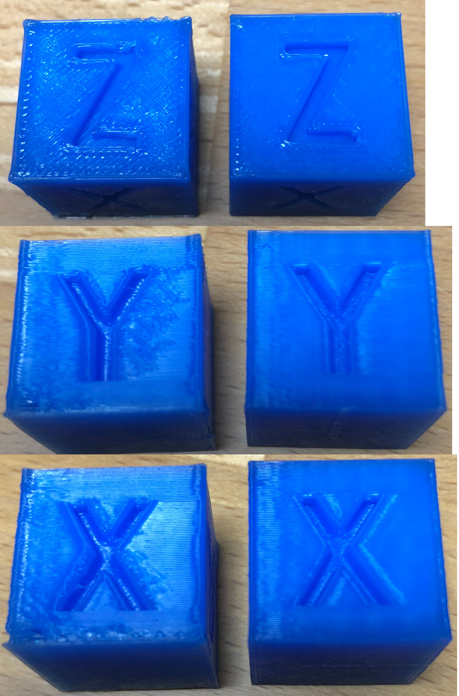

# Advance algorithm

## Definition

When you normally print, the extruder motor moves proportially to the
move in xy direction. In theory that is a great thing, because this is
exactly the amount we need at that time. 

Unfortunately physics has something against this solution. We need to press
the hot filament through a small nozzle. And this requires some force which
increases with speed. Filament has no infinite stiffness - in fact it is rather
flexible compared with carbon fiber for example. So what happens is that the
filament between the extruder motor where it gets driven and the nozzle acts
like a spring. The longer this distance is the weaker the equivalent spring
is. For a linear spring the force can be computed like this:

F = k * distance

With *k* = spring constant and *distance* the compressed distance of the spring.

So with this model, what happens is at the beginning we start moving with a start
speed and accelerate until target speed. So speed increases and we already know
that we need increasing force. But we start with no force at all and increase
distance just like speed, so we increase force and get more and more filament
with the disadvantage that we get not enough filament at the start. Filament is
a bit thinner then planned.

Next phase is constant speed. We keep getting more filament until we have the right
pressure for the speed and we have the expected line width.

Now comes the deceleration part. We reduce speed but we had pressure for the
fast speed. So you guess it, we get over extrusion and the extrusion gets wider.

So as a result we get the right total amount of plastic, just not at the spot
where we wanted it. But this decription already shows one trick to get a clean
extrusion. Try to keep the speed constant if possible.

Second trick is to print slow. That makes it easier to keep the same speed and
you need less force, so correction is much faster. Clever users do this for
the visible outer perimeter only and allow faster speeds on the outside. 

The last trick is the advance algorithm. The basic idea is dead simple. If we know
that the force is wrong, just do not move the extruder exactly proportional to the
xy move. Instead move it faster during acceleration and slower during deceleration.
That gives again the same extruded plastic, but now the start gets more and the end 
less compared to not using it. If we get the right distribution we should get exactly
the wanted constant width of extruded filament.

So far so good, but there are 2 things that cause a problem here:
1. If we start with speed x, we need already some pressure equal to the start speed. 
Otherwise we need to catch up the increasing speed plus the start speed.
2. If k is small we need to move a bigger distance to get the same force. That means the
 motor has to move faster to compensate changes. This is especially a problem with
 bowden extruders where the long bowden tube causes small k.
3. During deceleration we need get slower. Depending on k and acceleration we might even
need to invert extruder direction!

## Approximation

Here a small list of modulus of elasticity (Young's modulus) for some materials:

```
Material                    E [N/mm^2]
ABS                         2300
PLA                         3500
Glass                       60000
Rubber                      5
Steel                       210000    
```

With this the force can be computed by

F = E * A * delta_L / L

A = cross section of filament
L = distance between motor and nozzle
delta_L = compression

A(d = 1,75mm) = 2.4053 mm^2

A(d = 2.85mm) = 6.3794 mm^2

For further investigation we only conside 1.75mm filament and use PLA as material.

EA = 3500 * 2.4053 = 8418.55 N

Multiplying this with the strain delta_L / L gives the force. Let's consider 2 cases:
1. Direct extruder, L = 50 mm
2. Bowden extruder, L = 400 mm

From this we already see that a typical bowden system needs to move around 8 times
more then a direct extruder. Plus that if the filament is uncompressed there is
something like a backlash. So changing direction would require a backlash compensation
in addition to requiring to move 8 times more to achieve the same result.

Now comes the last unknown. What force exactly do we need. This greatly depends on
the following factors:
- Nozzle diameter
- Viscosity of filament and is therefore also temperature dependent
- Speed

For use in the firmware we assume that force is proportional to speed. Anything else
is not solvable and would also make it impossible for users to adjust settings
without expert knowledge.

For this example we assume that we need 10 N to push 10 mm/s of filament through
a 0.4mm nozzle. Using above equation transformed we get
delta_L = F * L / EA = L * 10 / 8418.55 = L * 0.0018785
- Direct extruder: delta_L = 0.0594 mm
- Bowden Extruder: delta_L = 0.4751 mm

Divisind by 10 (speed was 10) we get a factor K we could use to compute the
extra move. So extruder position would be

E_pos = nominal_E + K * current_E_speed
 
with K > 0 and using this only for positive E moves the E_pos will always
be in advance of the nominal_E position. Hence the name advance algorithm.

As you see the K value is rather small, so for better usage the value is multiplied
with factor 1000.

## Usage

The firmware implements the M900 command to allow using advance. With a

M900 K&lt;Kfactor>

you set the value for the currently active extruder. So not forget to set it
for the other extruder as well if oyu use more then one.

Then it comes to computing the correction. Normally you want the firmware to
convert extrusion speed to advance. This is the case when starting firmware
or by setting the extrusion ratio to 0:

M900 R0

This normally works very well, except when a slicer adds a E value that does
not generated the same width as before. So if slicers have a 0.5 mm wide extrusion
and suddenly a short move just has E for 0.05 mm width, the extruder would have
to do a extraordinary big move. Cura for example is known to generate such segments.
In this case you need tell firmware to assume a fixed extrusion width, so extruder
move does not freak out at such cases. Best is then also to use same extrusion width
and constant layer height for everything in the model.

M900 W&lt;extrusion width> H&lt;layer height> D&lt;filament diameter>

or set ratio directly using

M900 R&lt;ratio>

with

ratio = W * H / (D^2 * 0.25 * pi)

If you want to disable advance, simple set K to 0:

M900 K0

## Example

In this example we printed the calibration cube
[calibration cube](https://www.thingiverse.com/thing:214260/#comments)
with a speed of 80 mm/s for all perimeters and infill. Acceleration was 800
and yank 5 mm/s. The left sample was printed without advance while the right one
used K=40 which is the optimal setting for the filament.




What you clearly see in the left example is that the filament sometimes breaks
during acceleration. So there is not enough filament extruded to guarantee a
nice perimeter at the outside. In the top view you see also that the corners
clearly go outwards.

On the right side you see the oposite. No missing filament and the corners are
just as they are supposed to be. Also the infill looks much better here. So
there is an overall improvement that allows printing at higher speeds without
getting bad defects. 